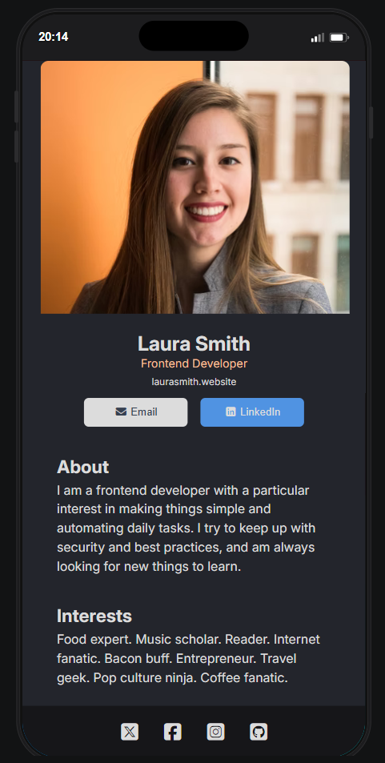

# Digital Business Card

> 🎉 **My First React Project**

A responsive **Digital Business Card** application built with **React**. This project represents my first experience building an application with React and demonstrates the fundamentals of component-based development, reusable UI components, and responsive web design.

## 📖 Overview

This project is a simple and elegant digital business card designed to showcase personal and professional information. It was created as my first React project to practice building user interfaces using React components and modern frontend development tools.

## ✨ Features

* Responsive design for desktop and mobile devices
* Component-based React architecture
* Profile header section
* Professional title and personal website display
* Contact buttons (Email and LinkedIn)
* About section
* Social media footer icons
* Custom styling with CSS variables
* Google Fonts integration (Inter)
* Font Awesome icons

## 🛠️ Built With

* React
* JavaScript (ES6+)
* CSS3
* HTML5
* Vite
* Font Awesome
* Google Fonts

## 📁 Project Structure

```text
project-root/
│
├── public/
│
├── src/
│   ├── Component/
│   │   ├── Header.jsx
│   │   ├── Main.jsx
│   │   └── Footer.jsx
│   │
│   ├── App.jsx
│   ├── main.jsx
│   └── index.css
│
├── index.html
├── package.json
└── README.md
```

## 🚀 Getting Started

### Prerequisites

Make sure you have installed:

* Node.js
* npm

## 🧩 Components

### App.jsx

The main application component that renders:

* Header component
* Main content component
* Footer component

### Header Component

Displays:

* Profile image
* Personal information

### Main Component

Displays:

* Name
* Job title
* Website
* Contact buttons
* About section

### Footer Component

Displays:

* Social media icons and links

## 🎨 Styling

The project uses CSS custom properties for consistent theming:

```css
:root {
    --background-color: #23252C;
    --main-background-color: #1A1B21;
    --text-color: #DCDCDC;
    --job-color: #F3BF99;
    --logo-color: #918E9B;
    --email-color: #374151;
    --LinkeDIn-color: #5093E2;
    --footer-background: #161619;
}
```

Features include:

* Responsive layouts
* Flexbox positioning
* CSS variables
* Hidden scrollbars
* Mobile-first design approach

## 📱 Responsive Design

The application adapts to different screen sizes using media queries:

```css
@media (min-width: 1024px)
```

Desktop layouts automatically adjust component widths for improved readability.

## 📸 Preview


This application includes:

* Profile image header
* Professional information section
* Contact action buttons
* Personal description area
* Social media footer

## 🎯 Learning Outcomes

As my first React project, I learned:

* Creating and organizing React components
* Passing and rendering JSX
* Structuring a React application
* Styling components with CSS
* Building responsive layouts
* Working with Vite and modern frontend tooling

## 👨‍💻 Author

**Peter Paing**

## 📄 License

This project was created for educational purposes and as part of my React learning journey.
